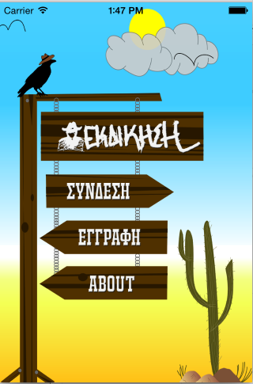
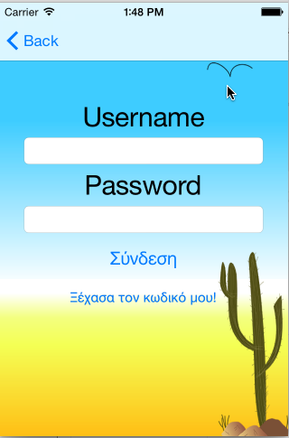
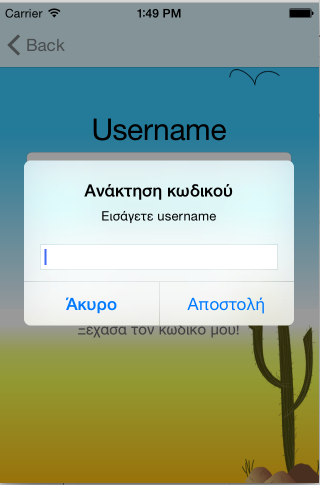
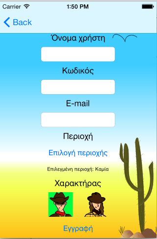
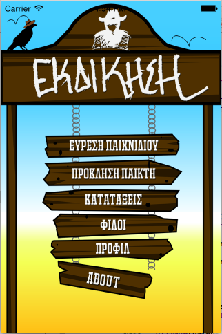
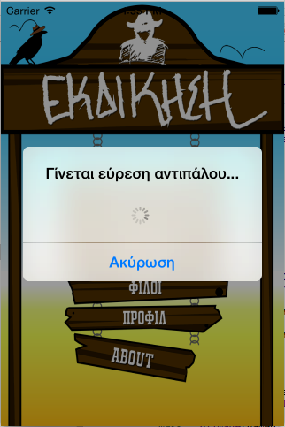
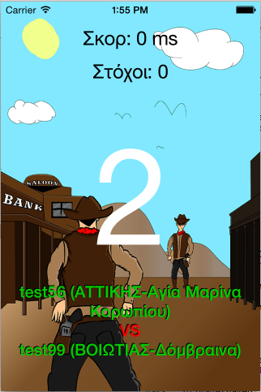
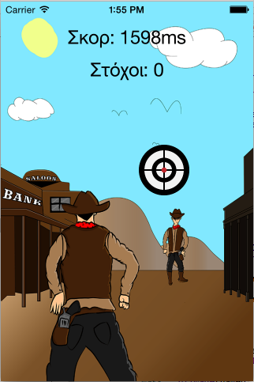
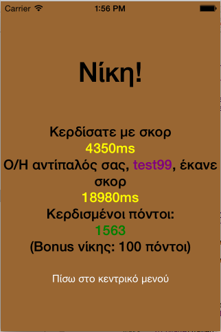

# Revenge-iOS
iOS version of Revenge (missing highscores,chat,profiles,friend system)

Revenge is a western-themed game where players battle against each other, putting their reflexes to the test by pressing on 20 targets faster than their opponents and earning personal points along with boosting their town and county points! Supports all towns and counties of Greece.

<html>

  <head>

  </head>

  <body>
  <h3>Welcome Activity</h3>
   

 
<h3>Manual Log In + Forgot password dialog</h3>
 

 
  <h3>Sign Up</h3>
   

 
<h3>Main Activity (Autologin here on application open)</h3>
 <h5>1)Search for opponent - 2)Challenge Player - 3)Highscores - 4)Friends - 5)Profile - 6)About</h5>
 

 
<h3>Searching for opponent</h3>
 

 
<h3>Game starting, game started,game ended</h3>
 

  </body>
</html>
